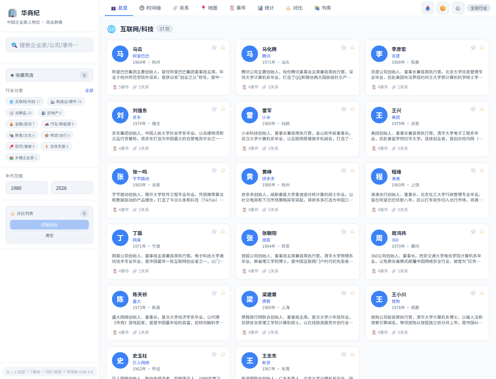
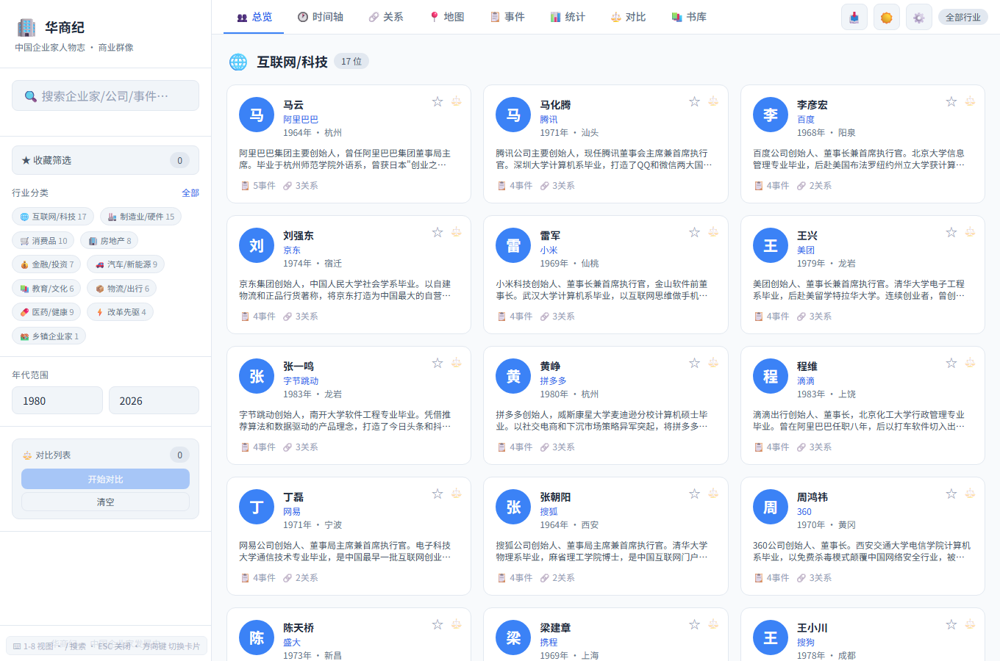
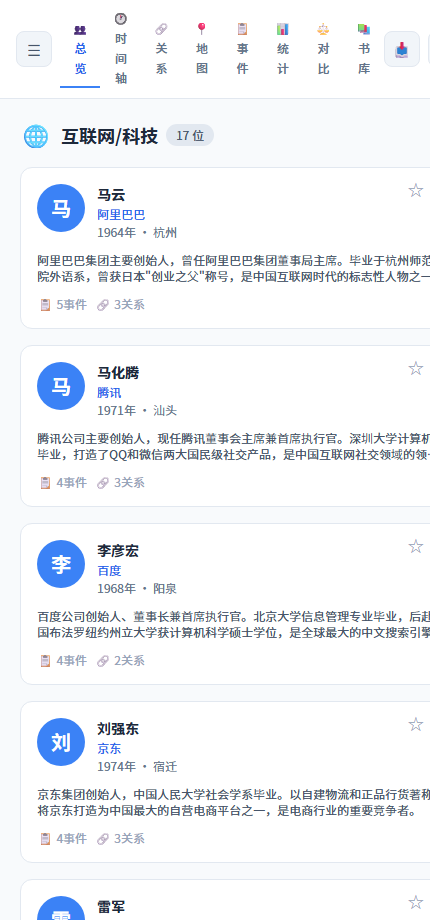
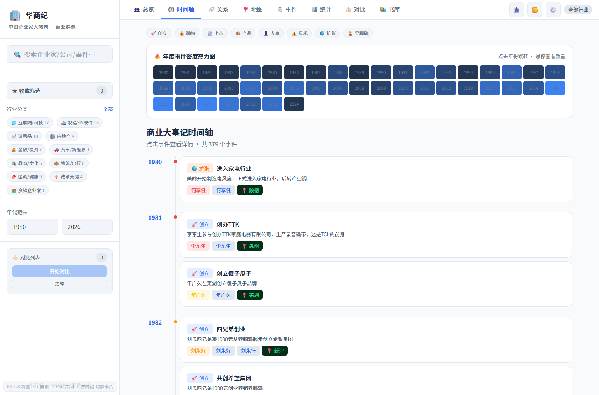
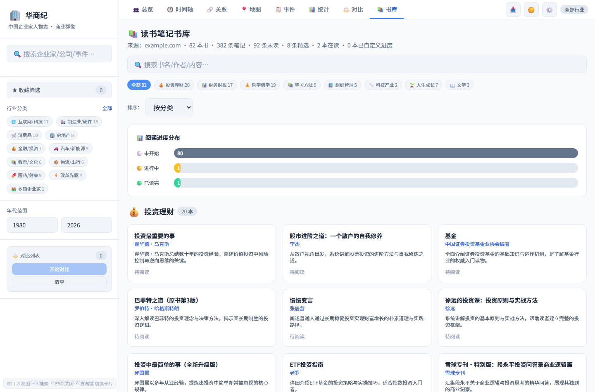

# OpenClaw 阅读卡片知识库

一个把人物、书籍、事件、行业、关系和地图组织成可搜索知识门户的静态系统，适合阅读笔记、企业家人物志和公开学习资料库。

**English introduction:** [README_EN.md](README_EN.md)

## 页面截图

下面四张图都来自本仓库真实中文页面渲染：首屏、滚动后的第二屏，以及两个关键功能视图。它们不是概念图，也不是英文占位图，能直接看到项目实际运行后的样子。

| 首屏截图 | 第二屏截图 |
|---|---|
|  |  |
|  |  |

## 系统功能总览

这个系统不是普通书单页面，而是一个“人物 + 书籍 + 事件 + 关系 + 地图 + 统计”的知识库界面。它适合把阅读笔记、企业家资料、行业人物和学习内容整理成一个可以筛选、浏览、对比和发布的静态门户。

## 核心功能

- **人物卡片总览**：按行业分类展示人物卡片，包含姓名、公司、年份、城市、简介、事件数量和关系数量。
- **全文搜索**：支持按企业家、公司、事件等关键词快速检索。
- **行业筛选**：按互联网/科技、制造业、消费品、房地产、金融、汽车、教育、医药等分类筛选。
- **年代范围筛选**：通过起止年份限制人物和事件范围。
- **收藏筛选**：可收藏人物并只查看收藏内容。
- **人物对比**：选择 2-3 位人物进行对比，适合做学习分析和人物研究。
- **时间轴视图**：将人物事件按年份组织，适合看行业和个人发展脉络。
- **关系网络视图**：用关系图展示人物之间的合作、竞争、投资、师友等连接。
- **地图视图**：按地点展示人物和事件分布，适合观察地域脉络。
- **事件列表**：集中浏览创业、融资、上市、产品、组织变化等事件。
- **统计视图**：用统计图观察行业、年代、事件类型等结构。
- **书库模块**：管理书籍、作者、阅读进度、分类和相关人物。
- **数据导出**：保留 CSV、JSON、网络图 SVG 等导出入口。
- **键盘导航与设置面板**：支持快捷键提示、主题切换、数据操作等体验细节。

## 适合改造成什么

- 个人阅读笔记系统
- 企业家人物志网站
- 行业知识库
- 课程资料导航
- 公开学习档案库

## 目录说明

- `index.html`：完整静态知识库界面。
- `data.js`：人物、事件、关系、地点和分类数据。
- `books.js`：书籍、作者、进度和书库数据。
- `manifest.json`：PWA 安装信息。

## 快速开始

直接打开 `index.html`，或部署到任意静态托管平台。

## 公开安全说明

这个公开版本已经移除真实部署地址、生产密钥、Cloudflare token、本地环境文件、日志、`.wrangler`、`node_modules` 和任何不适合公开的私有信息。你可以放心把它当作学习、参考和二次开发的起点。

## 推荐 Star 的理由

如果你正在做类似产品，这个仓库不是只能看一眼的截图，而是能直接 Fork 的结构样板：页面、数据、组件、交互和说明文档都已经整理好，可以节省从 0 到 1 搭骨架的时间。
