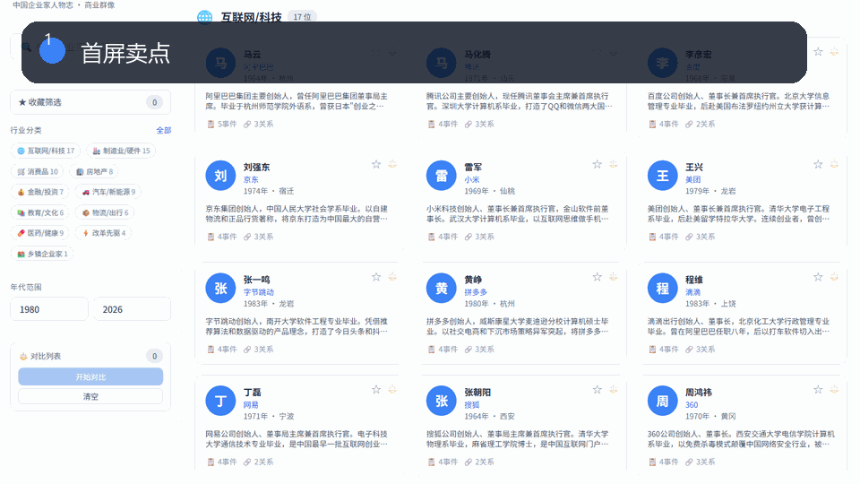

# OpenClaw Reading Cards Knowledge Base

A static knowledge portal for organizing people, books, events, industries, relationship networks, maps, and reading notes.

**中文介绍:** [README.md](README.md)

## Understand It In 3 Seconds

**Start here if you only open one OpenClaw repo: turn reading notes, profile data, and business events into a searchable static knowledge base.**

> Suggested first OpenClaw launch repo: it is the easiest one for readers, knowledge workers, frontend developers, and content builders to understand.

Good fit for:
- reading-note libraries
- founder profile sites
- industry people databases
- personal knowledge bases
- static content products

## Fork It In 30 Seconds

Fork it, replace `data.js` and `books.js`, and publish your own reading-card or profile library.

Main data to replace: `data.js` / `books.js`.

## Publish And Promote It

- Deployment guide: [docs/DEPLOYMENT.md](docs/DEPLOYMENT.md)
- Launch copy kit: [docs/LAUNCH_KIT.md](docs/LAUNCH_KIT.md)
- Social preview image: [docs/social-preview.png](docs/social-preview.png)

> If this template saves you from rebuilding the same product skeleton later, consider starring the repo.

## Screenshots

The four screenshots below come from the actual rendered Chinese pages in this repository: the opening screen, the scrolled second screen, and two additional feature-focused views. They are real UI captures, not concept art or English placeholder mockups.

| Opening Screen | Scrolled Screen |
|---|---|
|  |  |
|  |  |

## What This System Does

This is more than a reading-list page. It is a static knowledge-base interface that connects people, books, events, industries, relationships, maps, statistics, and reading progress into one navigable product.

## Core Features

- **Profile-card overview** grouped by industry, with person, company, year, city, bio, event count, and relationship count.
- **Full-text search** across people, companies, and events.
- **Industry filtering** for technology, manufacturing, consumer, real estate, finance, automotive, education, healthcare, and more.
- **Year-range filtering** for narrowing people and events by time period.
- **Favorites filter** for saving and reviewing selected profiles.
- **Person comparison** for comparing two or three entrepreneurs side by side.
- **Timeline view** for browsing events by year.
- **Relationship-network view** for cooperation, competition, investment, mentorship, and other links.
- **Map view** for exploring people and events by location.
- **Event list** for startup, funding, IPO, product, and organization milestones.
- **Statistics view** for industry, year, and event-type structure.
- **Book-library module** for books, authors, categories, reading progress, and related people.
- **Export entries** for CSV, JSON, and network SVG.
- **Keyboard navigation and settings panel** for a more complete product experience.

## Good Fit For

- Personal reading-note systems
- Entrepreneur biography libraries
- Industry knowledge bases
- Course material portals
- Public learning archives

## Repository Structure

- `index.html`: full static knowledge-base interface.
- `data.js`: people, events, relations, locations, and categories.
- `books.js`: book library and reading data.
- `manifest.json`: PWA metadata.

## Quick Start

Open `index.html` directly in a browser, or deploy the folder to any static hosting platform.

## Public-Safe Version

Private deployment URLs, production credentials, Cloudflare tokens, local environment files, logs, `.wrangler`, `node_modules`, and non-public material were removed before publication.

## Why Star This

Star this repository if you want a practical product pattern that can be studied, forked, customized, and turned into your own dashboard, content system, knowledge portal, or interactive tool.
